# <strong>Object detection in an Urban Environment</strong>

The purpose of this project is to apply different skills learned during Computer Vision Class for
Self Driving Car Engineer Nanodegree from Udacity. In this project, we will perform full workflow for deep learning pipelines from dataset analysis, training, evaluation and improvements.
This project will include use of the TensorFlow Object Detection API, Waymo dataset as input and TensorBoard for performances monitoring.

## <strong>Set up</strong>

### <strong>Data</strong>

For this project, we will be using data from the [Waymo Open dataset](https://waymo.com/open/). The files can be downloaded directly from the website as tar files or from the [Google Cloud Bucket](https://console.cloud.google.com/storage/browser/waymo_open_dataset_v_1_2_0_individual_files/) as individual tf records. 

### <strong>Structure</strong>

The data in the classroom workspace will be organized as follows:
```
/home/backups/
    - raw: contained the tf records in the Waymo Open format. (NOTE: this folder only contains temporary files and should be empty after running the download and process script)

/home/workspace/data/
    - processed: contained the tf records in the Tf Object detection api format. (NOTE: this folder should be empty after creating the splits)
    - test: contain the test data
    - train: contain the train data
    - val: contain the val data
```

The experiments folder will be organized as follow:
```
experiments/
    - exporter_main_v2.py: to create an inference model
    - model_main_tf2.py: to launch training
    - experiment0/....
    - experiment1/....
    - experiment2/...
    - pretrained-models/: contains the checkpoints of the pretrained models.
```

### <strong> Prerequisites</strong>

#### <strong>Local Setup</strong>

For local setup if you have your own Nvidia GPU, you can use the provided Dockerfile and requirements in the [build directory](./build).

Follow [the README therein](./build/README.md) to create a docker container and install all prerequisites.

#### <strong>Classroom Workspace</strong>

In the classroom workspace, every library and package should already be installed in your environment. However, you will need to login to Google Cloud using the following command:
```
gcloud auth login
```
This command will display a link that you need to copy and paste to your web browser. Follow the instructions. You can check if you are logged correctly by running :
```
gsutil ls gs://waymo_open_dataset_v_1_2_0_individual_files/
```
It should display the content of the bucket.

### <strong>Instructions</strong>

#### <strong>Download and process the data</strong>

The first goal of this project is to download the data from the Waymo's Google Cloud bucket to your local machine. For this project, we only need a subset of the data provided (for example, we do not need to use the Lidar data). Therefore, we are going to download and trim immediately each file. In `download_process.py`, you will need to implement the `create_tf_example` function. This function takes the components of a Waymo Tf record and save them in the Tf Object Detection api format. An example of such function is described [here](https://tensorflow-object-detection-api-tutorial.readthedocs.io/en/latest/training.html#create-tensorflow-records). We are already providing the `label_map.pbtxt` file. 

Once you have coded the function, you can run the script at using
```
python download_process.py --data_dir /home/workspace/data/ --temp_dir /home/backups/
```

You are downloading XX files so be patient! Once the script is done, you can look inside the `/home/workspace/data/processed` folder to see if the files have been downloaded and processed correctly.


#### <strong>Exploratory Data Analysis</strong>

Now that you have downloaded and processed the data, you should explore the dataset! This is the most important task of any machine learning project. To do so, open the `Exploratory Data Analysis` notebook. In this notebook, your first task will be to implement a `display_instances` function to display images and annotations using `matplotlib`. This should be very similar to the function you created during the course. Once you are done, feel free to spend more time exploring the data and report your findings. Report anything relevant about the dataset in the writeup.

Keep in mind that you should refer to this analysis to create the different spits (training, testing and validation). 


#### <strong>Create the splits</strong>

Now you have become one with the data! Congratulations! How will you use this knowledge to create the different splits: training, validation and testing. There are no single answer to this question but you will need to justify your choice in your submission. You will need to implement the `split_data` function in the `create_splits.py` file. Once you have implemented this function, run it using:
```
python create_splits.py --data_dir /home/workspace/data/
```

NOTE: Keep in mind that your storage is limited. The files should be <ins>moved</ins> and not copied. 

#### <strong>Edit the config file</strong>

Now you are ready for training. As we explain during the course, the Tf Object Detection API relies on **config files**. The config that we will use for this project is `pipeline.config`, which is the config for a SSD Resnet 50 640x640 model. You can learn more about the Single Shot Detector [here](https://arxiv.org/pdf/1512.02325.pdf). 

First, let's download the [pretrained model](http://download.tensorflow.org/models/object_detection/tf2/20200711/ssd_resnet50_v1_fpn_640x640_coco17_tpu-8.tar.gz) and move it to `training/pretrained-models/`. 

Now we need to edit the config files to change the location of the training and validation files, as well as the location of the label_map file, pretrained weights. We also need to adjust the batch size. To do so, run the following:
```
python edit_config.py --train_dir /home/workspace/data/train/ --eval_dir /home/workspace/data/val/ --batch_size 4 --checkpoint ./training/pretrained-models/ssd_resnet50_v1_fpn_640x640_coco17_tpu-8/checkpoint/ckpt-0 --label_map label_map.pbtxt
```
A new config file has been created, `pipeline_new.config`.

#### <strong>Training</strong>

You will now launch your very first experiment with the Tensorflow object detection API. Create a folder `training/reference`. Move the `pipeline_new.config` to this folder. You will now have to launch two processes: 
* a training process:
```
python model_main_tf2.py --model_dir=training/reference/ --pipeline_config_path=training/reference/pipeline_new.config
```
* an evaluation process:
```
python model_main_tf2.py --model_dir=training/reference/ --pipeline_config_path=training/reference/pipeline_new.config --checkpoint_dir=training/reference
```

NOTE: both processes will display some Tensorflow warnings.

To monitor the training, you can launch a tensorboard instance by running `tensorboard --logdir=training`. You will report your findings in the writeup. 

### <strong>Improve the performances</strong>

Most likely, this initial experiment did not yield optimal results. However, you can make multiple changes to the config file to improve this model. One obvious change consists in improving the data augmentation strategy. The [`preprocessor.proto`](https://github.com/tensorflow/models/blob/master/research/object_detection/protos/preprocessor.proto) file contains the different data augmentation method available in the Tf Object Detection API. To help you visualize these augmentations, we are providing a notebook: `Explore augmentations.ipynb`. Using this notebook, try different data augmentation combinations and select the one you think is optimal for our dataset. Justify your choices in the writeup. 

Keep in mind that the following are also available:
* experiment with the optimizer: type of optimizer, learning rate, scheduler etc
* experiment with the architecture. The Tf Object Detection API [model zoo](https://github.com/tensorflow/models/blob/master/research/object_detection/g3doc/tf2_detection_zoo.md) offers many architectures. Keep in mind that the `pipeline.config` file is unique for each architecture and you will have to edit it. 


### <strong>Creating an animation</strong>
#### <strong>Export the trained model</strong>
Modify the arguments of the following function to adjust it to your models:
```
python .\exporter_main_v2.py --input_type image_tensor --pipeline_config_path training/experiment0/pipeline.config --trained_checkpoint_dir training/experiment0/ckpt-50 --output_directory training/experiment0/exported_model/
```

Finally, you can create a video of your model's inferences for any tf record file. To do so, run the following command (modify it to your files):
```
python inference_video.py -labelmap_path label_map.pbtxt --model_path training/experiment0/exported_model/saved_model --tf_record_path /home/workspace/data/test/tf.record --config_path training/experiment0/pipeline_new.config --output_path animation.mp4
```


# <strong>Dataset</strong>

By looking at several subsamples, the dataset images were taken from different environments(subway/highway/city) with different weather conditions(foggy/sunny) and different times of the day(day/night). As images are extracted from a sequence of images subsampled by 10, some images are very close to each others.

The color legend for bounding boxes are as follows: 
>- RED: vehicles
>- BLUE: pedestrian
>- GREEN: cyclist

Below a subsample of 10 images randomly taken from the dataset.


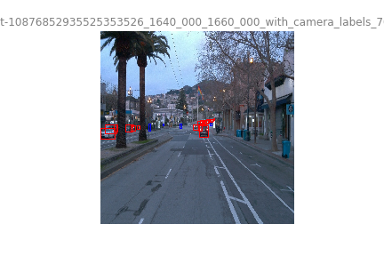
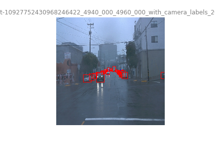

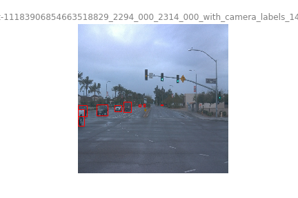

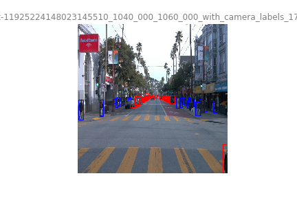


## <strong>Dataset analysis</strong>

For the rest of the analysis, we will use a subsample of 50,000 images.

### <strong>Class Distribution</strong>

Using classes histogram across 50,000 images, we notice a class inbalance. The class "vehicle" is highly dominant by almost 77%. The class "cyclist", in other side, is present in small amount across all images, only 0.59%.

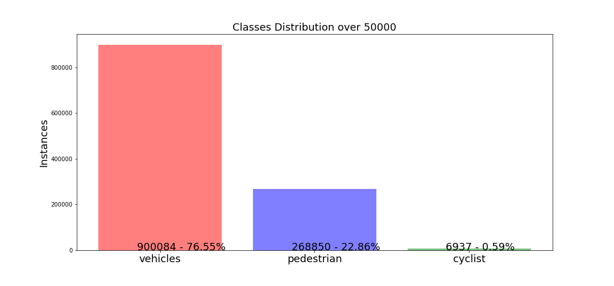


This can indicate the network model can have some difficulty to identify the cyclist due to the small amount of data regarding other classes. Basically, the network will overfit the vehicles and pedestrian classes.
The inbalance between classes can be reduced either by adding additional images of cyclists and pedestrians or by using class specific data augmentation. But the last technique present an issue, as many images contains multiple classes and even if we targeting cyclists(for example) we will add some new instances of other classes.

### <strong>Class Distribution per images</strong>

Global density of instances all classes is contained between 0 and 76 instances with an average of 25 instances per image. If we look to the number of instances across images, it will indicate the object density per image.

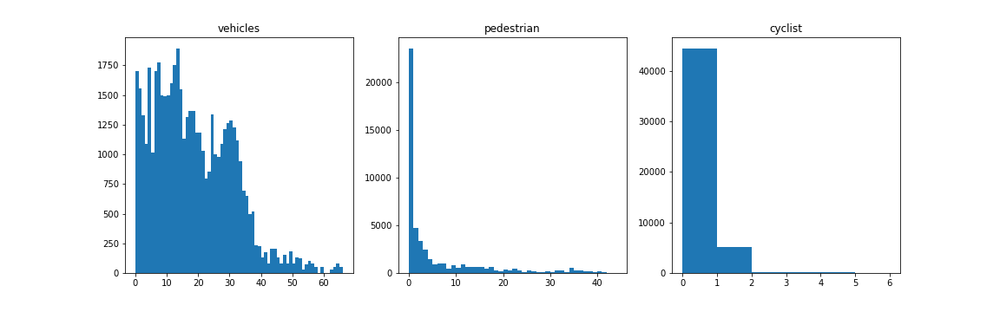

By looking to density histograms, we notice that major amount of images will contain a very low density of cyclists (at best five cyclists per image). In opposite, the vehicle class has a very high density with a distribution of density between 0 and 35 vehicles per image. The class pedestrian presents a high density between zero and five with a maximum of 42 pedestrians per image.

### <strong>Luminance Histogram</strong>

In addition to class distribution, we can look at the average luminance of images.

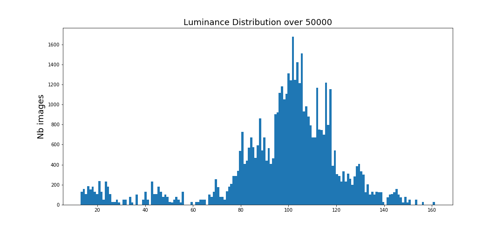

Images across the dataset have an average luminance of 103, with some darker and lighter images. However, it means that the NN model might present some trouble to detection on darker/lighter images. To improve it, we may need to add some data augmentation.

### <strong>Cross validation</strong>

As there is already test dataset, we use split_dataset to create train and validation dataset. We use 80/20 ratio if TFrecord for the split. In order to reduce a risk for class distribution, we shuffle the filenames randomly.

Before using the datasets, we check that the class distribution across train/val dataset is the same than for the whole dataset before split.

Distribution before:
>- VEHICULE: 76.55%
>- PEDESTRIAN: 22.86%
>- CYCLIST: 0.59%

Distribution after
>- VEHICULE: 76.19%
>- PEDESTRIAN: 23.18%
>- CYCLIST: 0.63%

If the test dataset does not exist, and corresponding flag is activated, the split uses the following ratios 72%/18%/10%.

# <strong>Training</strong>

Firstly, we running default setting of the Resnet50 model for fine-tuning on Waymo dataset (use of .config file provided by Udacity). Due to the use of limited space workspace to train, the number of steps will be fixed to 2500 with a batch size of two.
Accordingly to the number of steps, a training with more steps may provide better results for all following experiments.
## <strong>Reference experiment</strong>


>- The train total loss value on the default config is quite high and ends around 3.4.
Regarding the validation loss, it's much higher that the train model, around 5.3. As the training and validation curves are very far from each other one of the issue might be an overfitting on the training dataset.
>- By looking at [`object detection training tutorial`](https://tensorflow-object-detection-api-tutorial.readthedocs.io/en/latest/training.html) that uses exact same model, we notice that the original total loss is more around 1. As we reduced the batch size from the original model (64) to 2 due to space restriction, it might impact the overall loss. As the weights are updated only 2 images, the weights changes might be too important regarding the original learning rate. To fix that, in exeriment1 and experiment2 we will try to adapt the learning rate.


## <strong>Improve on the reference</strong>

### <strong>Experiment1 & Experiment2: Learning Rate vs Batch Size </strong>

For the experiment1 and 2, we adapt the learning rate to compensate the batch size reduction. To compute the learning rate reduction ratio we use the following formula:
$$ new\_learning\_rate = old\_learning\_rate\times\frac{new\_batch\_size}{old\_batch\_size}$$
We keep the cosin decay learning bu we adapting both learning rate parameters. By using th formula above, we obtain the values below:

>- learning_rate_base: 0.00125
>- warmup_learning_rate: 0.00041665625

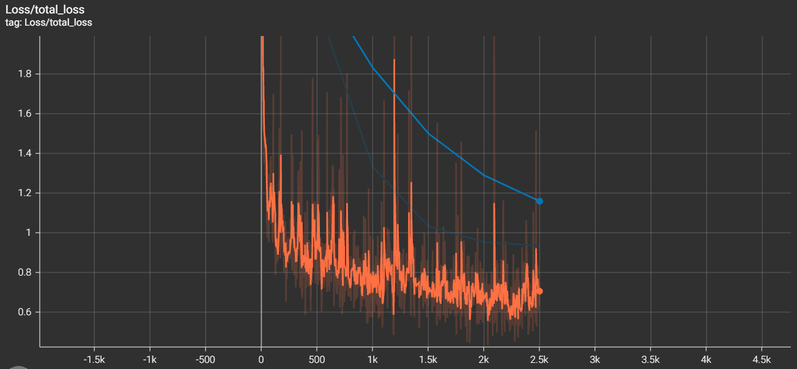

After correcting the learning rates, the training total loss after 2500 steps is around 0.7. In addition, the validation loss is down to 1.18. 
Even if we improved the loss curves, the validation loss is still not close to the training loss. It might indicate an overfitting on the training dataset. We will investigate to improve this issue in experiment3.

#### <strong>Experiment2</strong>

As we used batch_size ratio to adapt the learning rate, we tried even smaller learning rate with the following formula.

$$ new\_learning\_rate = \frac{old\_learning\_rate}{old\_batch\_size}$$

But, the total loss (training or validation), we didn't observe any improvements from experiment1 and we will keep the learning rates from experiment1.

### <strong>Experiment3</strong>

To fix the overfitting issue observed in experiment1/2, we introduce several data augmentation options. The following augmentations are added to the original .config file.
>- RGB to Gray
>- Random adjust Contrasts: allow to emulate night condition and compensate Luminance distribution in addition to Brightness.
>- Random adjust Brightness: the brightness distribution (see EDA) follows a uniform distribution, randomly adjust the brightness and contrast allow to improve detection on brighter and darker images.
>- Random Black Patches: as instance density is quite high in images (see EDA), it means that many instances might be subject to occlusions by other instances or other objects. Introducing black patches might improve the network for occlusion robustness for instance detection.

Below, examples of each data augmentation.

RGB to Gray             |  Random Contrast    |  Random Brightness   |  Random Patches
:-------------------------:|:-------------------------:|:-------------------------:|:-------------------------:
|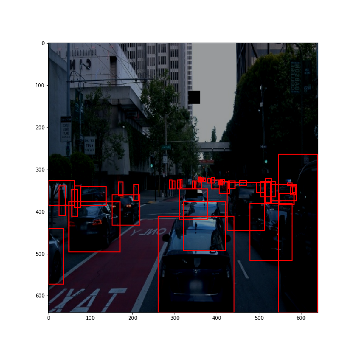|| 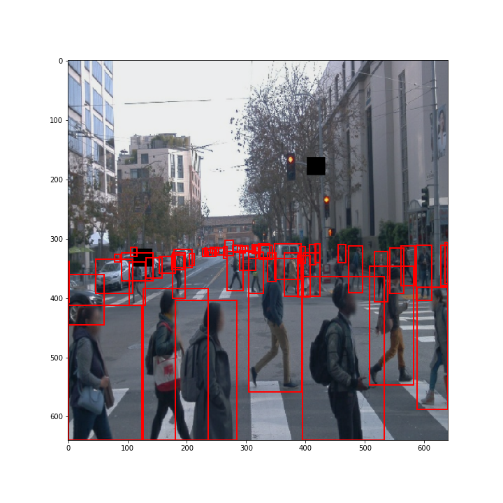

After running the train process, we obtain the following curves:

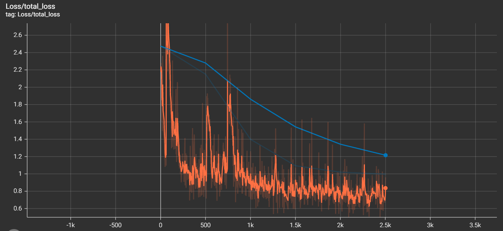

As we introduced many new images (augmented images) the training loss is slightly higher that in the experiment1(loss of around 0.15). The validation loss final value is similar to experiment one (only 0.05 of difference). But if we consider training loss vs validation loss, the validation loss is much close to training loss. It means that the data augmentation reduced the overfitting. Overall impact of the data augmentation is the loss curve form. It started at lower value and only decrease at each step.
By comparing to previous experiment1, the validation loss final steps derivative is lower than in experiment1. It might requires more steps than experiment1 to reach the validation loss plateau.

The precision and recall curves of experiment3, shows that the precision and recal are improving but they didn't yet reached the maximum achievable value.
 


### <strong>Further Improvements</strong>

>- Train in unconstrained environment to increase batch size and the number of steps.
>- Try different data augmentation parameters.
>- Test different architecture. However, different architecture selection will depend on the context, trade of between precision and runtime. Due to the limited amount of space, using a more deeper network might be impossible and it will not allow to reach correct loss in just 2500 steps.
>- This list is just some ideas to test and there is more tests that we can do to improve our performances, either regarding the data (data augmentation) , either network (change architecture) or training settings (change optimizer, learning rates).