# <strong>Project overview</strong>
This section should contain a brief description of the project and what we are trying to achieve. Why is object detection such an important component of self driving car systems?

## <strong>Set up</strong>
This section should contain a brief description of the steps to follow to run the code for this repository.

# <strong>Dataset</strong>

By looking at several subsamples, the dataset images were taken from different environments(subway/highway/city) with different weather conditions(foggy/sunny) and different times of the day(day/night). As images are extracted from a sequence of images subsampled by 10, some images are very close to each others.

The color legend for bounding boxes are as follows: 
>- RED: vehicles
>- BLUE: pedestrian
>- GREEN: cyclist

Below a subsample of 10 images randomly taken from the dataset.

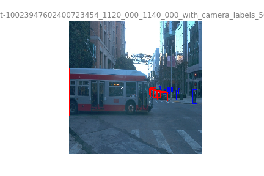
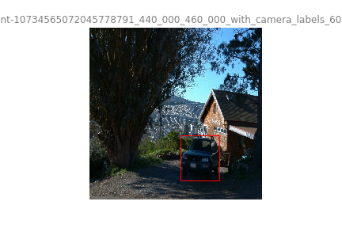
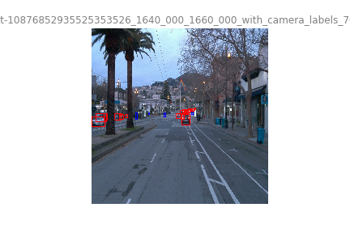
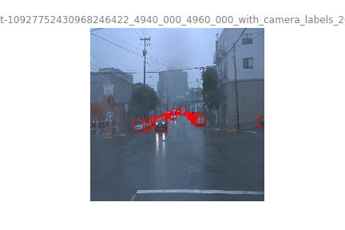
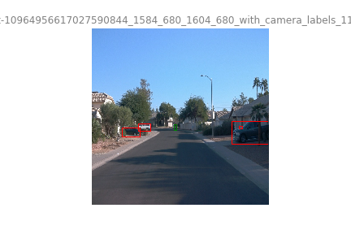
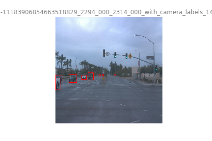
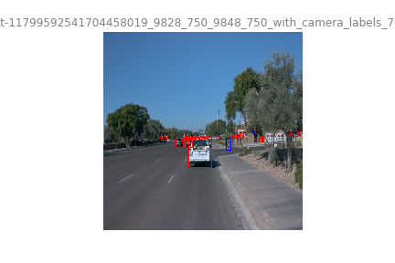
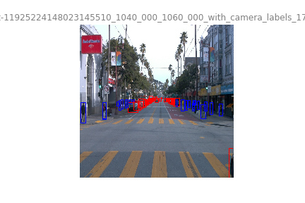
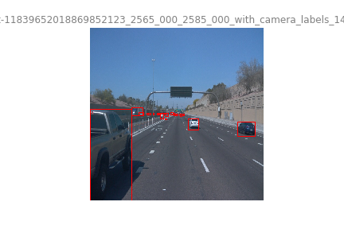
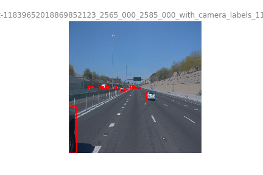

## <strong>Dataset analysis</strong>

For the rest of the analysis, we will use a subsample of 50,000 images.

### <strong>Class Distribution</strong>

Using classes histogram across 50,000 images, we notice a class inbalance. The class "vehicle" is highly dominant by almost 77%. The class "cyclist", in other side, is present in small amount across all images, only 0.59%.

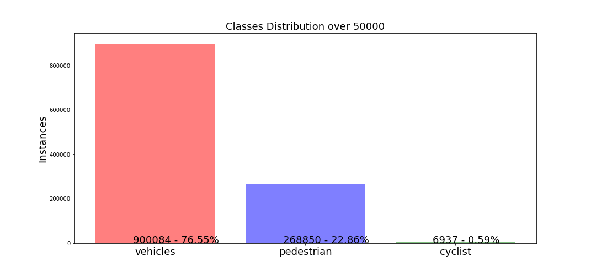

This can indicate the network model can have some difficulty to identify the cyclist due to the small amount of data regarding other classes. Basically, the network will overfit the vehicles and pedestrian classes.
The inbalance between classes can be reduced either by adding additional images of cyclists and pedestrians or by using class specific data augmentation. But the last technique present an issue, as many images contains multiple classes and even if we targeting cyclists(for example) we will add some new instances of other classes.

### <strong>Class Distribution per images</strong>

Global density of instances all classes is contained between 0 and 76 instances with an average of 25 instances per image. If we look to the number of instances across images, it will indicate the object density per image.

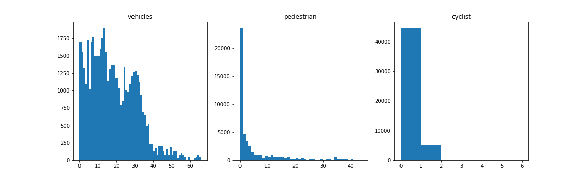

By looking to density histograms, we notice that major amount of images will contain a very low density of cyclists (at best five cyclists per image). In opposite, the vehicle class has a very high density with a distribution of density between 0 and 35 vehicles per image. The class pedestrian presents a high density between zero and five with a maximum of 42 pedestrians per image.

### <strong>Luminance Histogram</strong>

In addition to class distribution, we can look at the average luminance of images.

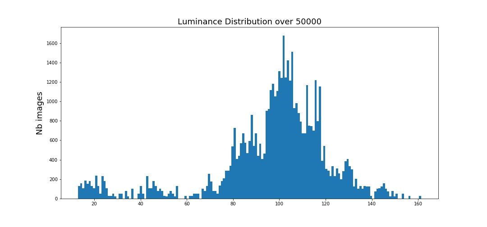

Images across the dataset have an average luminance of 103, with some darker and lighter images. However, it means that the NN model might present some trouble to detection on darker/lighter images. To improve it, we may need to add some data augmentation.

### <strong>Cross validation</strong>

As there is already test dataset, we use split_dataset to create train and validation dataset. We use 80/20 ratio if TFrecord for the split. In order to reduce a risk for class distribution, we shuffle the filenames randomly.

Before using the datasets, we check that the class distribution across train/val dataset is the same than for the whole dataset before split.

Distribution before:
>- VEHICULE: 76.55%
>- PEDESTRIAN: 22.86%
>- CYCLIST: 0.59%

Distribution after
>- VEHICULE: 76.19%
>- PEDESTRIAN: 23.18%
>- CYCLIST: 0.63%

# <strong>Training</strong>

Firstly, we running default setting of the Resnet50 model for fine-tuning on Waymo dataset (use of .config file provided by Udacity). Due to the use of limited space workspace to train, the number of steps will be fixed to 2500 with a batch size of two.
Accordingly to the number of steps, a training with more steps may provide better results for all following experiments.
## <strong>Reference experiment</strong>

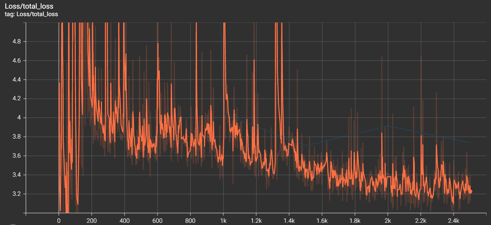

>- The train total loss value on the default config is quite high and ends around 3.4.
Regarding the validation loss, it's much higher that the train model, around 5.3. As the training and validation curves are very far from each other one of the issue might be an overfitting on the training dataset.
>- By looking at [`object detection training tutorial`](https://tensorflow-object-detection-api-tutorial.readthedocs.io/en/latest/training.html) that uses exact same model, we notice that the original total loss is more around 1. As we reduced the batch size from the original model (64) to 2 due to space restriction, it might impact the overall loss. As the weights are updated only 2 images, the weights changes might be too important regarding the original learning rate. To fix that, in exeriment1 and experiment2 we will try to adapt the learning rate.

## <strong>Improve on the reference</strong>

### <strong>Experiment1 & Experiment2: Learning Rate vs Batch Size </strong>

For the experiment1 and 2, we adapt the learning rate to compensate the batch size reduction. To compute the learning rate reduction ratio we use the following formula:
$$ new\_learning\_rate = old\_learning\_rate\times\frac{new\_batch\_size}{old\_batch\_size}$$
We keep the cosin decay learning bu we adapting both learning rate parameters. By using th formula above, we obtain the values below:

>- learning_rate_base: 0.00125
>- warmup_learning_rate: 0.00041665625

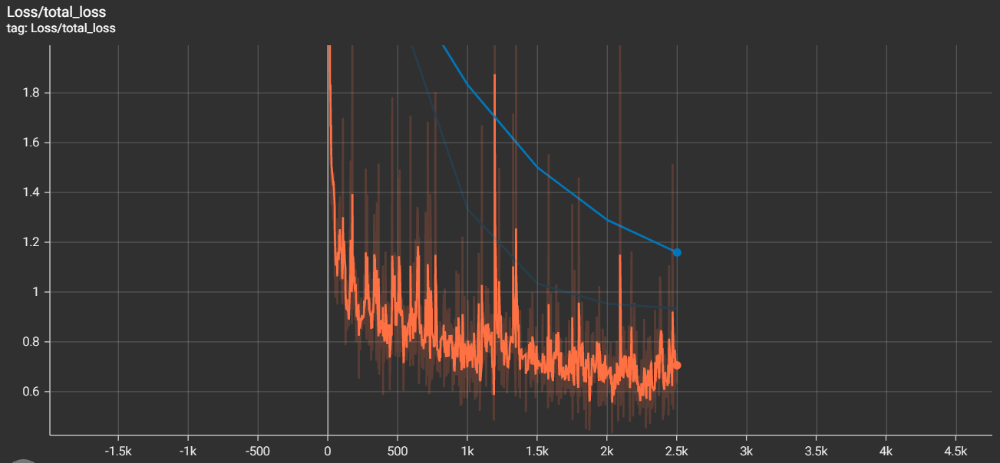

After correcting the learning rates, the training total loss after 2500 steps is around 0.7. In addition, the validation loss is down to 1.18. 
Even if we improved the loss curves, the validation loss is still not close to the training loss. It might indicate an overfitting on the training dataset. We will investigate to improve this issue in experiment3.

#### <strong>Experiment2</strong>

As we used batch_size ratio to adapt the learning rate, we tried even smaller learning rate with the following formula.

$$ new\_learning\_rate = \frac{old\_learning\_rate}{old\_batch\_size}$$

But, the total loss (training or validation), we didn't observe any improvements from experiment1 and we will keep the learning rates from experiment1.

### <strong>Experiment3</strong>

To fix the overfitting issue observed in experiment1/2, we introduce several data augmentation options. The following augmentations are added to the original .config file.
>- RGB to Gray
>- Random adjust Contrasts: allow to emulate night condition and compensate Luminance distribution in addition to Brightness.
>- Random adjust Brightness: the brightness distribution (see EDA) follows a uniform distribution, randomly adjust the brightness and contrast allow to improve detection on brighter and darker images.
>- Random Black Patches: as instance density is quite high in images (see EDA), it means that many instances might be subject to occlusions by other instances or other objects. Introducing black patches might improve the network for occlusion robustness for instance detection.

Below, examples of each data augmentation.

RGB to Gray             |  Random Contrast    |  Random Brightness   |  Random Patches
:-------------------------:|:-------------------------:|:-------------------------:|:-------------------------:
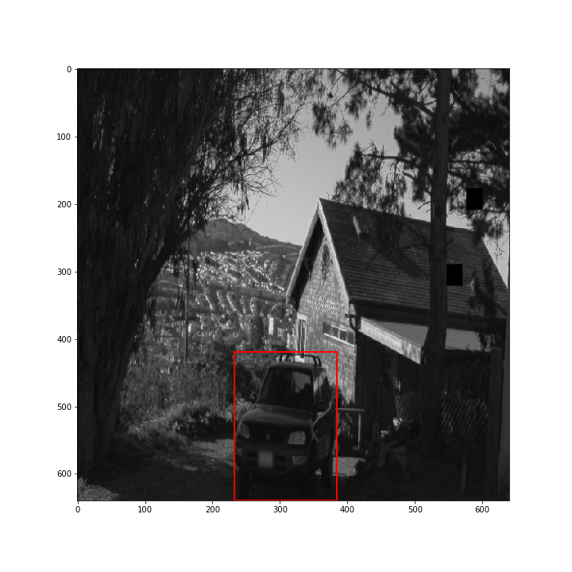|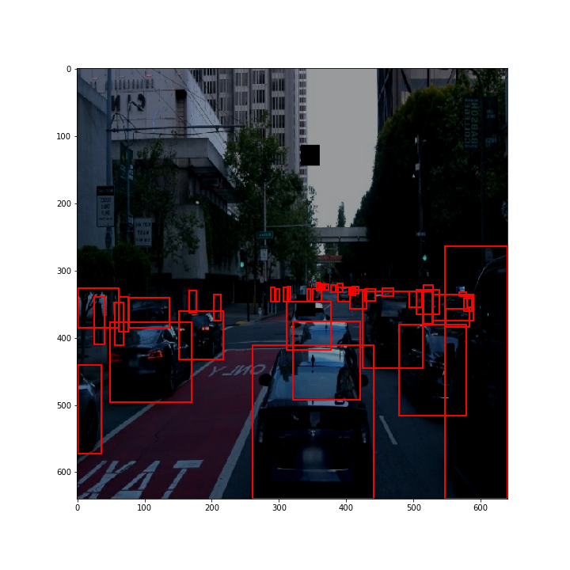|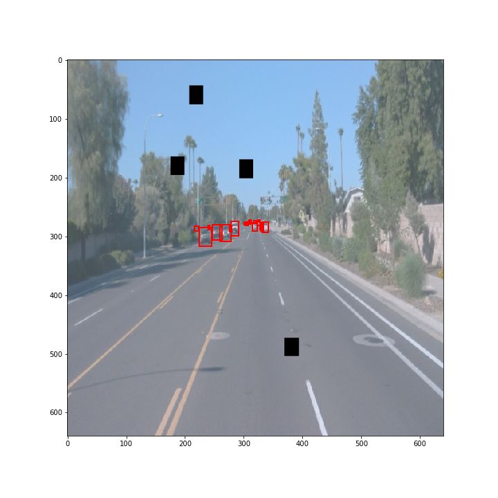| 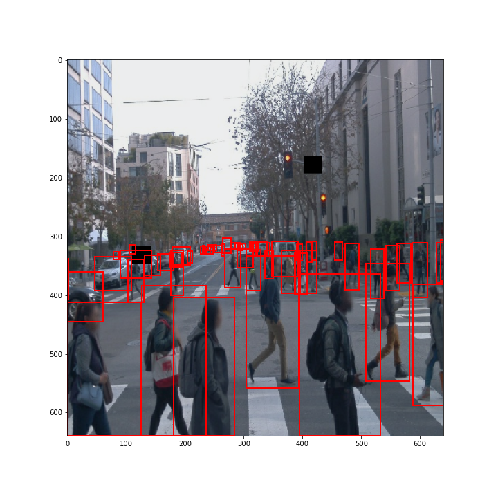

After running the train process, we obtain the following curves:

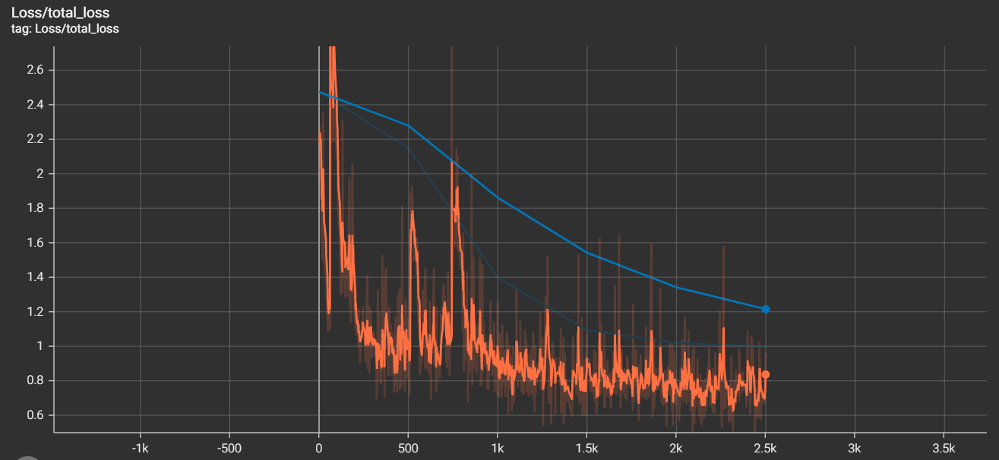

As we introduced many new images (augmented images) the training loss is slightly higher that in the experiment1(loss of around 0.15). The validation loss final value is similar to experiment one (only 0.05 of difference). But if we consider training loss vs validation loss, the validation loss is much close to training loss. It means that the data augmentation reduced the overfitting. Overall impact of the data augmentation is the loss curve form. It started at lower value and only decrease at each step.
By comparing to previous experiment1, the validation loss final steps derivative is lower than in experiment1. It might requires more steps than experiment1 to reach the validation loss plateau.

### <strong>Further Improvements</strong>

>- Train in unconstrained environment to increase batch size and the number of steps.
>- Try different data augmentation parameters.
>- Test different architecture. However, different architecture selection will depend on the context, trade of between precision and runtime. Due to the limited amount of space, using a more deeper network might be impossible and it will not allow to reach correct loss in just 2500 steps.
>- This list is just some ideas to test and there is more tests that we can do to improve our performances, either regarding the data (data augmentation) , either network (change architecture) or training settings (change optimizer, learning rates).